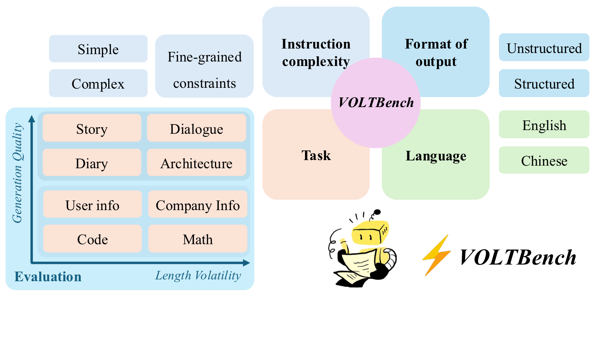

# VOLTBench

This repository contains the VOLTBench prompt instructions and generation scripts.



*An overview of the VOLTBench framework. Our benchmark is constructed from four dimensions, covering structured and unstructured tasks. We evaluate performance from two aspects: generation quality and length volatility.*

## Contents

- `Longen_instructions/`: English and Chinese prompt templates.
- `py_files/prompt_dict.py`: builds pickle prompt dictionaries from `Longen_instructions`.
- `py_files/*_Gen*.py`: local Hugging Face generation scripts.
- `py_files/LLM_Gen.py`: OpenAI-compatible API generation script using `OPENAI_API_KEY`.

## Examples

Build a prompt dictionary:

```bash
python py_files/prompt_dict.py --language EN --num-section 5 --word-section 200
python py_files/prompt_dict.py --language CH --num-section 5 --word-section 200
```

Run API generation:

```bash
export OPENAI_API_KEY="your_api_key"
python py_files/LLM_Gen.py --prompt-folder Longen_instructions/EN --model gpt-4o-mini
```

Run local Hugging Face generation:

```bash
python py_files/Qwen_7B_Gen_EN.py
python py_files/Qwen_7B_Gen.py
```

Run local Hugging Face generation with GLoBo logits boosting:

```bash
python py_files/prompt_dict.py --language CH --num-section 5 --word-section 200
python py_files/GLoBo_Gen.py \
  --prompt-folder Longen_instructions/CH \
  --model /path/to/local/model \
  --model-shortname Qwen2.5-7B \
  --only-pkl 5_200_dict.pkl
```

`GLoBo_Gen.py` only works with local Hugging Face models because it modifies logits during decoding. Use `--section-token-target`, `--grace-tokens`, `--boost`, or `--anchor-template` to tune the decoding behavior for a specific prompt format.
